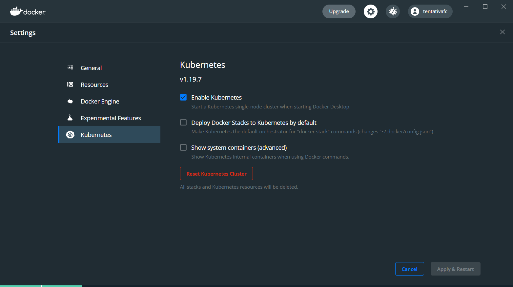
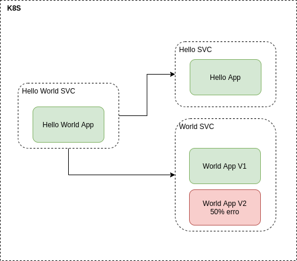
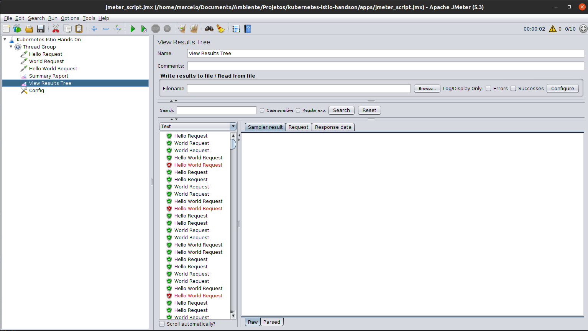
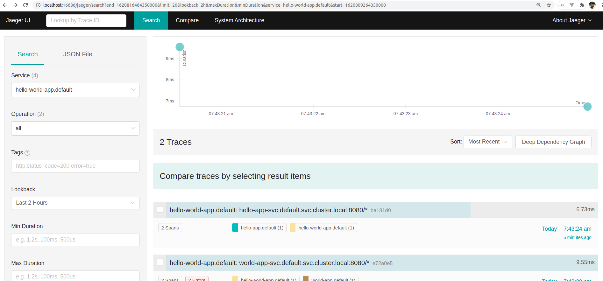
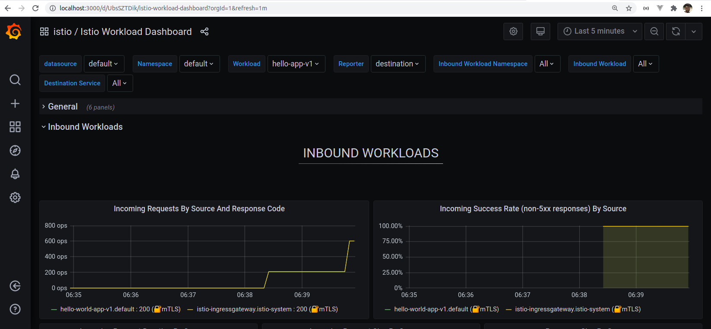
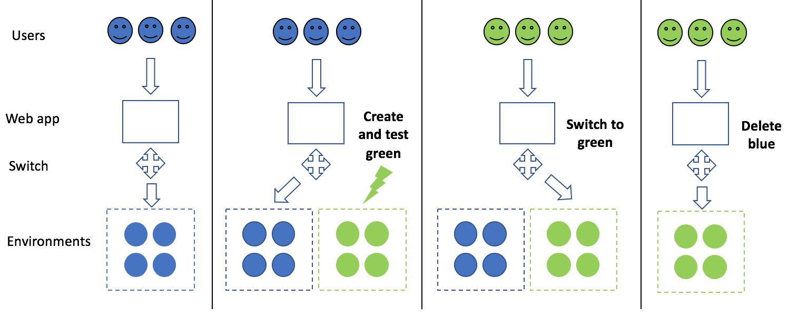

# Kubernetes e Istio Hands On

Kubernetes (K8s) é um produto Open Source utilizado para automatizar a implantação, o dimensionamento e o gerenciamento de aplicativos em contêiner
-- <cite>https://kubernetes.io</cite>

## Preparação do ambiente

- Instalar o Docker

  - [Linux](https://docs.docker.com/engine/install/)

  - [Windows](https://docs.docker.com/docker-for-windows/install/)

- Instalar o kubectl

  - [Linux](https://kubernetes.io/docs/tasks/tools/install-kubectl-linux/)

  - [Windows](https://kubernetes.io/docs/tasks/tools/install-kubectl-windows/)

### Linux:

- Instale o [k3d](https://k3d.io/)

* Criar o cluster

```sh
k3d cluster create k8s-istio-handson --servers 1 --agents 1 --port 9080:80@loadbalancer --port 9443:443@loadbalancer --api-port 6443 --k3s-server-arg '--no-deploy=traefik'
```

Cria o kubeconfig e configura o contexto para o kubectl:

```sh
k3d kubeconfig merge k8s-istio-handson --kubeconfig-switch-context
```

### Windows:

Habilite o kubernetes no Docker desktop, conforme imagem abaixo:


-- from <cite>author</cite>

Altere o contexto do kubectl para o docker-desktop:

```sh
kubectl config get-contexts
kubectl config use-context docker-desktop
```

## Kubernetes

### Client

_kubectl_ é o client oficial do K8s. Através dele, interagimos com o cluster e objetos K8s, tais como pods, services, deployments...

### Contextos

```sh
kubectl config get-contexts
kubectl config use-context k3d-k8s-istio-handson
```

Link com detalhes dos arquivos kubeconfig: https://kubernetes.io/pt-br/docs/concepts/configuration/organize-cluster-access-kubeconfig/

#### Cluster status

```sh
kubectl get componentstatuses
```


-- from <cite>author</cite>

### [Componentes do Cluster](https://kubernetes.io/pt-br/docs/concepts/overview/components/)


-- from <cite>https://kubernetes.io/pt-br/docs/concepts/overview/components/</cite>

Um cluster Kubernetes consiste em um conjunto de servidores de processamento, chamados nós, que executam aplicações containerizadas. Todo cluster possui ao menos um servidor de processamento (worker node).

O servidor de processamento hospeda os Pods que são componentes de uma aplicação. O ambiente de gerenciamento gerencia os nós de processamento e os Pods no cluster. Em ambientes de produção, o ambiente de gerenciamento geralmente executa em múltiplos computadores e um cluster geralmente executa em múltiplos nós (nodes), provendo tolerância a falhas e alta disponibilidade.

-- from <cite>https://kubernetes.io/pt-br/docs/concepts/overview/components/</cite>

#### Control Plane

Os componentes do control plane são responsáveis em manter a saúde do cluster.

- _controler-manager_: Responsável regular os componentes do cluster. Ex: Assegura que todas as réplicas de um serviço estão disponíveis e saudáveis.

- _scheduler_: Responsável em escalonar os diferentes pods em diferentes nós.

- _etcd_: banco de dados chave valor do cluster.

#### Nodes

Podemos pensar em node como uma máquina física ou virtual que irá rodar um conjunto de containers. Cada node possui alguns componentes pré instalados responsáveis por comunicação com outros nodes e com o Control Plane.

- _kubelet_: Agente que controla e garante a disponibilidade dos pods.

- _kubernetes-proxy_: Componente responsável em rotear o tráfego de rede para os serviços de load balancer no cluster.

- _container-runtime_: agente responsável por executar os containers

```sh
kubectl get nodes
```


-- from <cite>author</cite>

#### Addons

Componentes que complementam as funcionalidades do Cluster.

- _kubernetes-dns_: Roda um DNS server e provê um serviço de nome e descoberta ao cluster.

```sh
kubectl get services --namespace=kube-system
```


-- from <cite>author</cite>

### Namespaces

O Kubernetes usa os namespaces para organizar os objetos no cluster. Uma analogia é pensar em namespaces como diretórios, onde cada diretório tenha seus respectivos objetos. Conforme imagem anterior, o Kubernetes tem seu próprio namespace chamado _kube-system_, e por default trabalhamos com o namespace _default_ para nossas aplicações.

```sh
kubectl get pods --all-namespaces
```

### Objetos

Os tipos de objetos são utilizados para diversas finalidades.

A seguir destaco os principais:

#### Pod

Menor unidade de deploy. Pode conter um ou mais containers. A configuração se faz através de um arquivo yaml chamado pod manifest.

```yaml
apiVersion: v1
kind: Pod
metadata:
  name: nginx-demo
  labels:
    web: nginx
spec:
  containers:
    - name: nginx
      image: nginx:1.7.9
      ports:
        - containerPort: 80
```

Criação do pod:

```sh
kubectl apply -f k8s/nginx-pod.yaml
```

Listagem:

```sh
kubectl get pods --output=wide
```


-- from <cite>author</cite>

Detalhes:

```sh
kubectl describe pods nginx-demo
```


-- from <cite>author</cite>

#### Service:

Os objetos serviços dão aos pods ou deployments, a capacidade de receber um dns e também terem o service-discovery automático.

Exposição para o mundo externo:

```sh
# List services
kubectl get services
# Expose pod
kubectl expose pod nginx-demo --port 80 --type=LoadBalancer
# List services again
kubectl get services
```


-- from <cite>author</cite>


-- from <cite>author</cite>

Após o teste, remover o service loadbalancer:

```sh
# Delete svc
kubectl delete svc nginx-demo
```

#### Deployment

Um Deployment é um objeto de recurso no Kubernetes que fornece atualizações declarativas para aplicações. Além disso, ela permite descrever o ciclo de vida das aplicações, incluindo quais imagens usar, o número de pods necessários e como devem ser feitas as atualizações.

Com um deployment Kubernetes, você pode:

- Implantar um pod ou conjunto de réplicas
- Atualizar pods e conjuntos de réplicas
- Reverter para versões anteriores da implantação
- Escalar implantações
- Pausar ou continuar uma implantação

-- from <cite>https://www.redhat.com/pt-br/topics/containers/what-is-kubernetes-deployment</cite>

```yaml
apiVersion: apps/v1
kind: Deployment
metadata:
  name: nginx-deployment
  labels:
    app: nginx
spec:
  replicas: 3
  selector:
    matchLabels:
      app: nginx
  template:
    metadata:
      labels:
        app: nginx
    spec:
      containers:
        - name: nginx
          image: nginx:1.7.9
          ports:
            - containerPort: 80
```


-- from <cite>author</cite>

#### ReplicaSet

O propósito da ReplicaSet é configurar e manter estável o conjunto de réplicas dos pods.

-- from <cite>https://kubernetes.io/docs/concepts/workloads/controllers/replicaset/</cite>

## Helm

Helm é um gerenciador de pacotes para o kubernetes. Utilizaremos ele para instalação do Istio.

### Instalação

Baixar a [última versão](https://github.com/helm/helm/releases) e seguir o [passo a passo](https://helm.sh/docs/intro/install/).

#### Linux:

```sh
# Environment Vars
export HELM_HOME=/home/marcelo/Documents/Ambiente/helm-v3.5.4
export PATH=$HELM_HOME:$PATH
```

#### Windows:

Crie a variável de ambiente como **HELM_HOME** e inclua no **PATH**

### Configuração

Seguir [passo a passo](https://helm.sh/docs/intro/quickstart/).
Configure o repo stable e o atualize:

```sh
# Add repo stable
helm repo add stable https://charts.helm.sh/stable
# Update repo
helm repo update
```

## Istio

Os principais desafios quando trabalhamos monolitos e microservices estão relacionados com segurança, controle de tráfego, observabilidade e telemetria.

O Istio é uma ferramenta opensource que ajuda a resolver esses problemas através da disponibilização de uma **malha de serviços**(**service mesh**) em um cluster Kubernetes.

O termo **service mesh** é usado para descrever a rede de microservicos que compoem as aplicações e as interações entre elas. Os requisitos incluem service discovery, load balance, métricas e monitoração, teste A/B, implantações canário, limite de tráfego, controle de acesso e autenticação de ponta a ponta.


-- from <cite>https://istio.io/latest/docs/concepts/what-is-istio/</cite>

### Componentes

#### Envoy

Istio usa uma extensão do Envoy Proxy. Envoy é um proxy de alta performance desenvovlido em C++ e é utilizado para mediar todo o tráfego de entrada e saida de todos os serviços na malha de serviços.

Envoy é implantado como sidecar, dando as seguintes funcionalidades aos serviços:

- Service Discovery Dinâmico
- Load balancing
- TLS
- HTTP/2 and proxies gRPC
- Circuit breakers
- Health checks
- Rollout usando porcentagem de tráfego
- Métricas

-- from <cite>https://istio.io/latest/docs/ops/deployment/architecture/</cite>

#### Istiod

Istiod provê service discovery (**Pilot**), configuração(**Citadel**) e gerenciamento de certificados(**Galley**).

Istiod também converte as regras de roteamente e controla o controle de tráfego para os sidecars em runtime.

-- from <cite>https://istio.io/latest/docs/ops/deployment/architecture/</cite>

### Instalação com Helm

Seguir o [passo a passo](https://istio.io/latest/docs/setup/install/helm/).

Baixar o Istio [1.9.3](https://github.com/istio/istio/releases/tag/1.9.3)

#### Linux:

```sh
# Environment Vars
export ISTIO_HOME=/home/marcelo/Documents/Ambiente/istio-1.9.3
export PATH=$ISTIO_HOME/bin:$PATH
```

#### Windows:

Crie a variável de ambiente como **ISTIO_HOME** e inclua no **PATH** a configuração **%ISTIO_HOME%\bin**.

#### Configuração

```sh
# Create namespace for Istio components
kubectl create namespace istio-system

# Install Istio base chart
helm install istio-base $ISTIO_HOME/manifests/charts/base -n istio-system

# Install Istio discovery chart
helm install istiod $ISTIO_HOME/manifests/charts/istio-control/istio-discovery -n istio-system

# Install Istio ingress chart
helm install istio-ingress $ISTIO_HOME/manifests/charts/gateways/istio-ingress -n istio-system

# Install Istio egress chart
helm install istio-egress $ISTIO_HOME/manifests/charts/gateways/istio-egress -n istio-system

# Check installation
kubectl get pods -n istio-system
```

Obs: No ambiente Windows, troque o **$ISTIO_HOME** por **%ISTIO_HOME%**


-- from <cite>author</cite>

### Instalação manual

Seguir o [passo a passo](https://istio.io/latest/docs/setup/getting-started/).

### Configuração do Sidecar

O componente principal para o Istio é o Sidecar. Ele é responsável pelo controle, log e tráfego dos dados aos pods. A configuração se faz através do seguinte comando:

```sh
kubectl label namespace default istio-injection=enabled
```

O comando informa ao Istio para injetar automaticamente o sidecar aos pods do namespace **default**.

## Demo

Essa demo possui a seguinte arquitetura:


-- from <cite>author</cite>

#### Hello App

Possui webservice que retorna "Hello". Imagem já disponível no **[Docker Hub](https://hub.docker.com/r/tentativafc/hello-app/tags?page=1&ordering=last_updated)**.

#### World App

Possui webservice que retorna "World". Um diferencial desta aplicação é que ela possui uma propriedade (**application.percentual_erro=50**) indicando a porcentagem de erros. A proposta é simular um deploy com algum problema. A **v1** não contém erros e a **v2** possui 50% de chances de dar erro. Ambas imagens já disponíveis no **[Docker Hub](https://hub.docker.com/r/tentativafc/world-app/tags?page=1&ordering=last_updated)**.

#### Hello World App

A aplicação orquestra as chamadas da **Hello App** e **World App**, concatenando o retorno das duas APIs. Imagem já disponível no **[Docker Hub](https://hub.docker.com/r/tentativafc/helloworld-app/tags?page=1&ordering=last_updated)**.

### Build das imagens (Opcional)

- No arquivo **apps/make.sh**, substitua o valor da variável **YOUR_DOCKER_HUB_USER** pela sua conta.

- execute o comando:

  Linux:

  ```sh
  sh make.sh
  ```

  Windows:

  ```sh
  make.bat
  ```

### Deploy do Hello App

- No arquivo **k8s/hello-app.yaml**, substitua o valor **tentativafc** pelo seu usuário do Docker Hub (Opcional).

- execute o comando:

  ```sh
  kubectl apply -f k8s/hello-app.yaml
  ```

### Deploy do World App

- No arquivo **k8s/world-app.yaml**, substitua o valor **tentativafc** pelo seu usuário do Docker Hub (Opcional).

- execute o comando:

  ```sh
  kubectl apply -f k8s/world-app.yaml
  ```

### Deploy do Hello World App

- No arquivo **k8s/hello-world-app.yaml**, substitua o valor **tentativafc** pelo seu usuário do Docker Hub (Opcional).

- execute o comando:

  ```sh
  kubectl apply -f k8s/hello-world-app.yaml
  ```

### Disponibilizando para acesso externo

No Istio, para o acesso externo, precisamos configurar o Gateway e os Virtual Servers

- execute o comando:

  ```sh
  kubectl apply -f k8s/gateway.yaml
  ```

#### Obtendo o host e porta

```sh
export INGRESS_HOST=$(kubectl -n istio-system get service istio-ingressgateway -o jsonpath='{.status.loadBalancer.ingress[0].ip}')
export INGRESS_PORT=$(kubectl -n istio-system get service istio-ingressgateway -o jsonpath='{.spec.ports[?(@.name=="http2")].nodePort}')
export SECURE_INGRESS_PORT=$(kubectl -n istio-system get service istio-ingressgateway -o jsonpath='{.spec.ports[?(@.name=="https")].nodePort}')
export GATEWAY_URL=$INGRESS_HOST:$INGRESS_PORT
# Testando a chamada para hello-world app
echo "http://$GATEWAY_URL/hello-world/say-hello-world"
```

### Rodar o script jmeter

No arquivo csv **app/jmeter_config.csv** configure o host e a porta com os respectivos valores das variáveis **\$INGRESS_HOST** e **\$INGRESS_PORT**.

Execute o jmeter utiilzando o script **app/jmeter_config.jmx**


-- from <cite>author</cite>

## Complementos Istio

O Istio já possui alguns complementos na sua pasta home. Os passos a seguir demonstram a instalação e visualização de cada um.

```sh
# Install addons (Prometheus, Grafana, Jaeger and Kiali):
kubectl apply -f $ISTIO_HOME/samples/addons
```

### Kiali

Kiali é uma ferramenta de visualização de **mesh** do cluster. Para acessar o dashboard, execute o comando:

```sh
istioctl dashboard kiali
```


-- from <cite>author</cite>

### Jaeger

[Jaeger](https://www.jaegertracing.io/docs/) é uma ferramenta de trace distribuído das aplicações. Através de um traceid, ele agrupa toda a stack de chamadas. Para visualizá-lo, utilize o seguinte comando:

```sh
istioctl dashboard jaeger
```


-- from <cite>author</cite>

### Grafana

[Grafana](https://grafana.com/) é uma ferramenta de observality. Esse complemento já pré configura alguns dashboards com as métricas coletadas pelo sidecar Istio.

```sh
istioctl dashboard grafana
```


-- from <cite>author</cite>

## Horizontal Autoscaling

Através da análise de métricas dos pods, o K8S possui um recurso destinado ao scaling horizontal dos pods.

O [Metric Server](https://github.com/kubernetes-sigs/metrics-server) é um recurso instalado separadamente e funciona como um coletor de métricas. Através dessas métricas coletadas, podemos criar regras de autoscaling através da configuracao HPA.

### Instalacao Metric Server

kubectl apply -f https://github.com/kubernetes-sigs/metrics-server/releases/latest/download/components.yaml

kubectl get pods -n kube-system

### Demo

```sh
# Instalaćão da aplicacao de exemplo
kubectl apply -f k8s/hpa.yaml

# Criacao manual do hpa para a aplicacao de exeplo
kubectl autoscale deployment php-apache --cpu-percent=50 --min=1 --max=10

# Listagem dos objetos hpa
kubectl get hpa

# Forcando uma carga
kubectl run -i --tty load-generator --rm --image=busybox --restart=Never -- /bin/sh -c "while sleep 0.01; do wget -q -O- http://php-apache; done"


kubectl get hpa
```

```sh
# Instalacao com podmanifest
kubectl apply -f ./k8s/hpa-v2.yaml
```

## Controle de deployments

Um dos desafios do Countinous Delivery é garantir que o software com as novas features, funcionem corretamente.
Há a necessidade portanto de estruturas de deployments que garantam a entrega das novas funcionalidades, que essas entregas não gerem indisponibilidade, que ocorram um teste pilotado em produćão, e caso tudo esteja de acordo com os critérios de aceite, ocorra a liberaćão da nova versão para o restante do público.

Abordaremos aqui os dois modelos de deployments mais utilizados no mercado.

### [Blue Green](https://martinfowler.com/bliki/BlueGreenDeployment.html)

O Deployment Blue Green parte da premissa que devemos sempre ter disponíveis dois ambientes. O primeiro (chamaremos de Blue) com a versão atual da aplicaćão, e o segundo (Green) com a nova versão da aplicaćão. Após o deployment, todo o tráfego é direcionado para a nova aplicaćão (Green) e caso se identifique-se problemas, o tráfego é direcionado novamente para a versão anterior da aplicaćão (Blue).


-- from <cite>https://docs.aws.amazon.com/wellarchitected/latest/machine-learning-lens/bluegreen-deployments.html</cite>

Com o Istio, podemos ter esse modelo de deployment através da disponibilizaćão de pesos no tráfego para as versões da aplicaćão.

```yaml
    gateway.yaml
    ...    
    route:
    - destination:
        host: world-app-svc
        port:
          number: 8080
        subset: v1
      weight: 100
    - destination:
        host: world-app-svc
        port:
          number: 8080
        subset: v2
      weight: 0
```

#### Demo
 
### Canário

O Deployment Canário, também ocorre a dispobilizaćão dos dois ambientes (Blue e Green), porém somente uma pequena parte do tráfego é direcionado para nova versão. Nesse modelo pode-se adotar uma porcentagem do tráfego ou também podemos utilizar outras informaćões como Http Headers para a utilizacão dos beta testers.


-- from <cite>https://docs.aws.amazon.com/wellarchitected/latest/machine-learning-lens/bluegreen-deployments.html</cite>

Demo:

### [Istio](https://istio.io/latest/blog/2017/0.1-canary/)

```yaml
    gateway.yaml
    ...    
    route:
    - destination:
        host: world-app-svc
        port:
          number: 8080
        subset: v1
      weight: 100
    - destination:
        host: world-app-svc
        port:
          number: 8080
        subset: v2
      weight: 0
```

### Flagger

#### [Instalaćão](https://docs.flagger.app/install/flagger-install-on-kubernetes):

Helm:

```sh
# Repo
helm repo add flagger https://flagger.app
# CRD
kubectl apply -f https://raw.githubusercontent.com/fluxcd/flagger/main/artifacts/flagger/crd.yaml
# Deploy with istio
helm upgrade -i flagger flagger/flagger \
--namespace=istio-system \
--set crd.create=false \
--set meshProvider=istio \
--set metricsServer=http://prometheus:9090
```

Manual:

```sh
kubectl apply -k github.com/fluxcd/flagger//kustomize/istio
```

172.18.0.2

kubectl apply -f k8s/world-with-flagger.yaml

kubectl apply -f k8s/world-with-flagger-gateway.yaml

kubectl apply -f k8s/world-canary.yaml