# Kubernetes e Istio Hands On

Kubernetes (K8s) é um produto Open Source utilizado para automatizar a implantação, o dimensionamento e o gerenciamento de aplicativos em contêiner
-- <cite>https://kubernetes.io</cite>

## Preparação do ambiente

- Instalar o kubectl

  - [linux](https://kubernetes.io/docs/tasks/tools/install-kubectl-linux/)

  - [windows](https://kubernetes.io/docs/tasks/tools/install-kubectl-windows/)

- Instalar [k3d](https://k3d.io/)

* Criar o cluster

```sh
k3d cluster create k8s-istio-handson --servers 1 --agents 3 --port 9080:80@loadbalancer --port 9443:443@loadbalancer --api-port 6443 --k3s-server-arg '--no-deploy=traefik'
```

Configurar o kubectl para o cluster k3d:

```sh
k3d kubeconfig merge k8s-istio-handson --kubeconfig-switch-context
```

## Kubernetes

### Client

_kubectl_ é o client oficial do K8s, e utilizamos ele para interagir com os objetos, como pods, services e deployments.

#### Cluster status

```sh
kubectl get componentstatuses
```

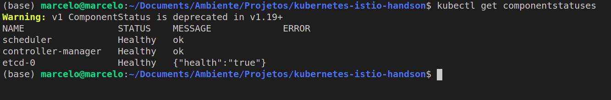
-- from <cite>author</cite>

### [Componentes do Cluster](https://kubernetes.io/pt-br/docs/concepts/overview/components/)


-- from <cite>https://kubernetes.io/pt-br/docs/concepts/overview/components/</cite>

Um cluster Kubernetes consiste em um conjunto de servidores de processamento, chamados nós, que executam aplicações containerizadas. Todo cluster possui ao menos um servidor de processamento (worker node).

O servidor de processamento hospeda os Pods que são componentes de uma aplicação. O ambiente de gerenciamento gerencia os nós de processamento e os Pods no cluster. Em ambientes de produção, o ambiente de gerenciamento geralmente executa em múltiplos computadores e um cluster geralmente executa em múltiplos nós (nodes), provendo tolerância a falhas e alta disponibilidade.

-- from <cite>https://kubernetes.io/pt-br/docs/concepts/overview/components/</cite>

#### Control Plane

Os componentes do control plane são responsáveis em manter a saúde do cluster.

- _controler-manager_: Responsável regular os componentes do cluster. Ex: Assegura que todas as réplicas de um serviço estão disponíveis e saudáveis.

- _scheduler_: Responsável em escalonar os diferentes pods em diferentes nós.

- _etcd_: banco de dados chave valor do cluster.

#### Nodes

Podemos pensar em node como uma máquina física ou virtual que irá rodar um conjunto de containers. Cada node possui alguns componentes pré instalados responsáveis por comunicação com outros nodes e com o Control Plane.

- _kubelet_: Agente que controla e garante a disponibilidade dos pods.

- _kubernetes-proxy_: Componente responsável em rotear o tráfego de rede para os serviços de load balancer no cluster.

- _container-runtime_: agente responsável por executar os containers

```sh
kubectl get nodes
```

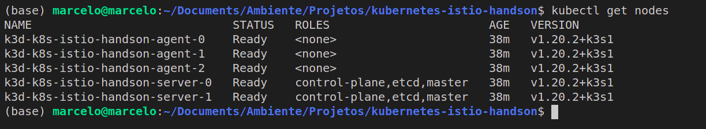
-- from <cite>author</cite>

#### Addons

Componentes que complementam as funcionalidades do Cluster.

- _kubernetes-dns_: Roda um DNS server e provê um serviço de nome e descoberta ao cluster.

```sh
kubectl get services --namespace=kube-system
```

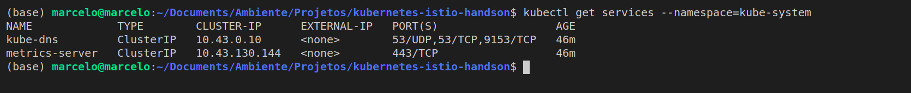
-- from <cite>author</cite>

### Namespaces

O Kubernetes usa os namespaces para organizar os objetos no cluster. Uma analogia é pensar em namespaces como pastas, onde cada pasta tenha seus respectivos objetos. Conforme imagem anterior, o Kubernetes tem seu próprio namespace chamado _kube-system_, e por default trabalhamos com o namespace _default_ para nossas aplicações.

```sh
kubectl get pods --all-namespaces
```

### Objetos

Os tipos de objetos são utilizados para diversas finalidades.

A seguir destaco os principais:

#### Pod

Menor unidade de deploy. Pode conter um ou mais containers. A configuração se faz através de um arquivo yaml chamado pod manifest.

```yaml
apiVersion: v1
kind: Pod
metadata:
  name: nginx-demo
  labels:
    web: nginx
spec:
  containers:
    - name: nginx
      image: nginx:1.7.9
      ports:
        - containerPort: 80
```

Criação do pod:

```sh
kubectl apply -f k8s/nginx-pod.yaml
```

Listagem:

```sh
kubectl get pods --output=wide
```

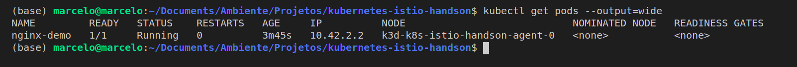
-- from <cite>author</cite>

Detalhes:

```sh
kubectl describe pods nginx-demo
```

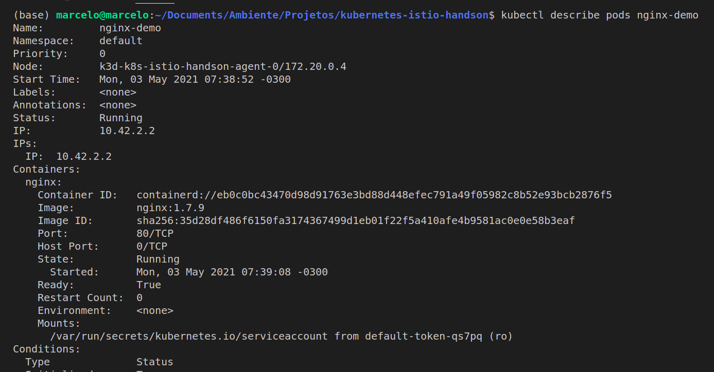
-- from <cite>author</cite>

#### Service:

Os objetos serviços dão aos pods ou deployments, a capacidade de receber um dns e também terem o service-discovery automático.

Exposição para o mundo externo:

```sh
# List services
kubectl get services
# Expose pod
kubectl expose pod nginx-demo --port 80 --type=LoadBalancer
# List services again
kubectl get services
```

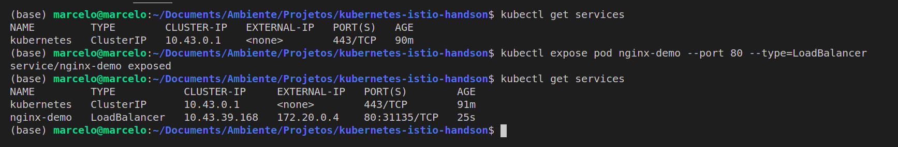
-- from <cite>author</cite>

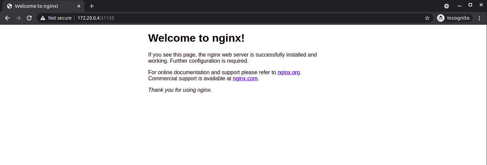
-- from <cite>author</cite>

#### Deployment

Um Deployment é um objeto de recurso no Kubernetes que fornece atualizações declarativas para aplicações. Além disso, ela permite descrever o ciclo de vida das aplicações, incluindo quais imagens usar, o número de pods necessários e como devem ser feitas as atualizações.

Com um deployment Kubernetes, você pode:

- Implantar um pod ou conjunto de réplicas
- Atualizar pods e conjuntos de réplicas
- Reverter para versões anteriores da implantação
- Escalar implantações
- Pausar ou continuar uma implantação

-- from <cite>https://www.redhat.com/pt-br/topics/containers/what-is-kubernetes-deployment</cite>

```yaml
apiVersion: apps/v1
kind: Deployment
metadata:
  name: nginx-deployment
  labels:
    app: nginx
spec:
  replicas: 3
  selector:
    matchLabels:
      app: nginx
  template:
    metadata:
      labels:
        app: nginx
    spec:
      containers:
        - name: nginx
          image: nginx:1.7.9
          ports:
            - containerPort: 80
```

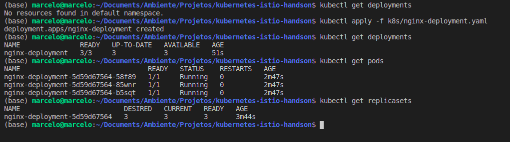
-- from <cite>author</cite>

#### Replicaset

O propósito da ReplicaSet é configurar e manter estável o conjunto de réplicas dos pods.

-- from <cite>https://kubernetes.io/docs/concepts/workloads/controllers/replicaset/</cite>

## Helm

Helm é um gerenciador de pacotes para o kubernetes. Utilizaremos ele para instalação do Istio.

### Instalação

Baixar a [última versão](https://github.com/helm/helm/releases) e seguir o [passo a passo](https://helm.sh/docs/intro/install/).

Linux:

```sh
# Environment Vars
export HELM_HOME=/home/marcelo/Documents/Ambiente/helm-v3.5.4
export PATH=$HELM_HOME:$PATH

# Add repo stable
helm repo add stable https://charts.helm.sh/stable
# Update repo
helm repo update
```

### Configuração

Seguir [passo a passo](https://helm.sh/docs/intro/quickstart/).

## Istio

Os principais desafios quando trabalhamos monolitos e microservices estão relacionados com segurança, controle de tráfego, observabilidade e telemetria.

O Istio é uma ferramenta opensource que ajuda a resolver esses problemas através da disponibilização de um **service mesh** em um cluster Kubernetes.

O termo **service mesh** é usado para descrever a rede de microservicos que compoem as aplicações e as interações entre elas. Os requisitos podem incluem service discovery, load balance, métricas e monitoração, teste A/B, implantações canário, limite de tráfego, controle de acesso e autenticação de ponta a ponta.


-- from <cite>https://istio.io/latest/docs/concepts/what-is-istio/</cite>

### Instalação com Helm

Seguir o [passo a passo](https://istio.io/latest/docs/setup/install/helm/).

Linux:

```sh
# Environment Vars
export ISTIO_HOME=/home/marcelo/Documents/Ambiente/istio-1.9.3
export PATH=$ISTIO_HOME/bin:$PATH

# Create namespace for Istio components
kubectl create namespace istio-system

# Install Istio base chart
helm install istio-base $ISTIO_HOME/manifests/charts/base \
  -n istio-system

# Install Istio discovery chart
helm install istiod $ISTIO_HOME/manifests/charts/istio-control/istio-discovery \
 -n istio-system

# Install Istio ingress chart
helm install istio-ingress $ISTIO_HOME/manifests/charts/gateways/istio-ingress \
  -n istio-system

# Install Istio egress chart
helm install istio-egress $ISTIO_HOME/manifests/charts/gateways/istio-egress \
  -n istio-system

# Check installation
kubectl get pods -n istio-system
```

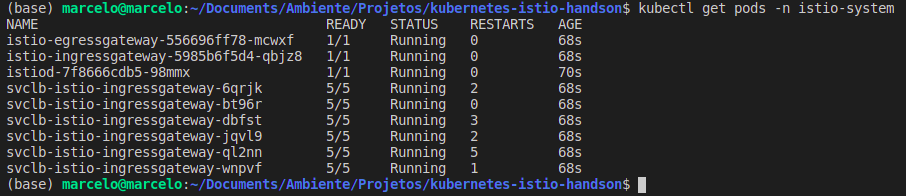
-- from <cite>author</cite>

### Instalação manual

Seguir o [passo a passo](https://istio.io/latest/docs/setup/getting-started/).

### Configuração do Sidecar

O componente principal para o Istio é o Sidecar. Ele é responsável pelo controle, log e tráfego dos dados aos pods. A configuração se faz através do seguinte comando:

```sh
kubectl label namespace default istio-injection=enabled
```

O comando informa ao instio para injetar automaticamente o sidecar aos pods do namespade **default**.

## Demo

### Build das imagens

- No arquivo apps/make.sh, substitua o valor da variável **YOUR_DOCKER_HUB_USER** pela sua conta.

- execute o comando:

  ```sh
  sh make.sh
  ```

### Deploy do Hello App

- No arquivo **k8s/hello-app.yaml**, substitua o valor **YOUR_DOCKER_HUB_USER** pelo seu usuário do Docker Hub.

- execute o comando:

  ```sh
  kubectl apply -f k8s/hello-app.yaml
  ```

### Deploy do World App

- No arquivo **k8s/world-app.yaml**, substitua o valor **YOUR_DOCKER_HUB_USER** pelo seu usuário do Docker Hub.

- execute o comando:

  ```sh
  kubectl apply -f k8s/world-app.yaml
  ```

### Deploy do Hello World App

- No arquivo **k8s/hello-world-app.yaml**, substitua o valor **YOUR_DOCKER_HUB_USER** pelo seu usuário do Docker Hub.

- execute o comando:

  ```sh
  kubectl apply -f k8s/hello-world-app.yaml
  ```

### Disponibilizando para acesso externo

No Istio, para o acesso externo, precisamos configurar o Gateway e os Virtual Servers

- execute o comando:

  ```sh
  kubectl apply -f k8s/gateway.yaml
  ```

#### Obtendo o host e porta

```sh
kubectl get svc istio-ingressgateway -n istio-system

export INGRESS_HOST=$(kubectl -n istio-system get service istio-ingressgateway -o jsonpath='{.status.loadBalancer.ingress[0].ip}')
export INGRESS_PORT=$(kubectl -n istio-system get service istio-ingressgateway -o jsonpath='{.spec.ports[?(@.name=="http2")].nodePort}')
export SECURE_INGRESS_PORT=$(kubectl -n istio-system get service istio-ingressgateway -o jsonpath='{.spec.ports[?(@.name=="https")].nodePort}')
export GATEWAY_URL=$INGRESS_HOST:$INGRESS_PORT
# Testando a chamada para hello-world app
echo "http://$GATEWAY_URL/hello-world/say-hello-world"
```

### Rodar o script jmeter

Abrir o script **app/jmeter_script.jmx** e editar as portas e urls dos requests, conforme image a seguir.

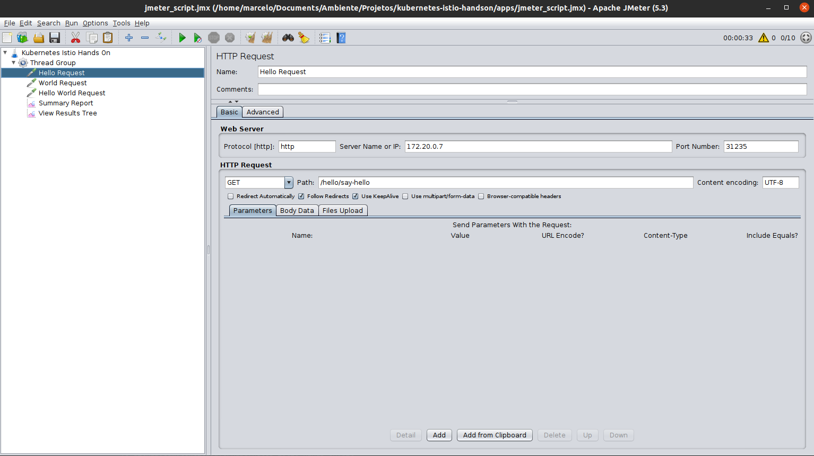
-- from <cite>author</cite>

## Istio AddsOn

O Istio já possui alguns complementos na sua pasta home. Os passos a seguir demonstram a instalação e visualização de cada um.

```sh
# Install addons (Prometheus, Grafana, Jaeger and Kiali):
kubectl apply -f $ISTIO_HOME/samples/addons
```

### Kiali

Kiali é uma ferramenta de visualização de **mesh** do cluster. Para acessar o dashboard, execute o comando:

```sh
istioctl dashboard kiali
```

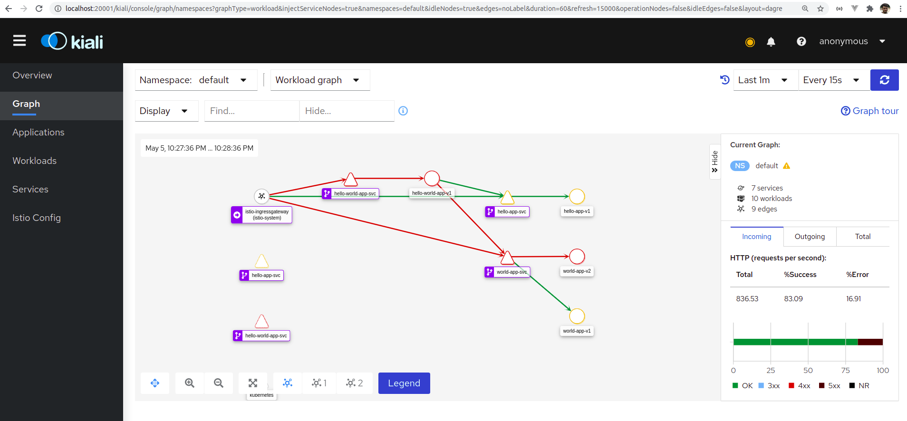
-- from <cite>author</cite>
